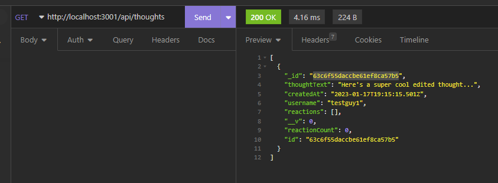

# Week 18: NoSQL Back End

## Description

For our 18th week in our coding bootcamp, we were tasked with creating a simple, but powerful express.js hosted backend for a hypothetical social network using Mongoose. Creating an application backend is nothing new at this point, but the main point of the exercise was to get a hold on how Mongoose works and how to perform CRUD operations.

A nice and simple project to get us used to the syntax of Mongoose. There were no real massive hurdles when building this app, an api rich backend dealing with databases is more than familiar by this point. My brain practically went into Sequelize Autopilot mode making the appropriate models and routes, occasionally taking a moment to appreciate how Mongoose is just *that* much better as a dev experience.

Making the models went off without a hitch, whether from experience of making models for a number of database structures or how air tight Mongoose is. When it came to making the routes the GET's and GET by ID's were no problem, and I really liked how Mongoose handles updating data in a collection. The format of `{ _id: } { $set or $addToSet or $pull }` was very smooth, and managing the Reaction subdoc within Thoughts couldn't have been easier. A very painless experience all around!

## Installation and Testing

To download the app, clone this repo to your machine and run `npm i` to download all relevant dependencies.

To test the various routes, run `npm run start` and make requests to `http://localhost:3001/api` in your API development tool of choice. (Insomnia is recommended).

## Usage

- To get all user in the database, make a GET request to `./users`

- To retrieve a particular user's data, make a GET request to `./users/:userId`

- To create a new user, POST a JSON object formatted like the example to `./users`

- PUT requests require a JSON object identical to a POST, but must be made to `./users/:userId`

- DELETE requests are made to `./users/:userId` and will cascade the deletion to that user's thoughts as well.

- To add a user to another user's friends array, make a POST request to `./users/:userId/friends/:friendId` where userId is the one having its array updated, and friendId is the friend being added.

- To remove a user from another's friend array, make a DELETE request to the same URL where userId is the user who's friends list will be updated, and friendId is the user who will be removed.

- To get all thoughts in the database, make a GET request to `./thoughts`

- To get a specific thought by ID, make a GET request to `./thoughts/:thoughtId`

- To create a new thought, make a POST request with a JSON object formatted like the example to `./thoughts`

- PUT requests are made to `./thoughts/:thoughtId` with a JSON object formatted identical to a POST request.

- DELETE requests are made to `./thoughts/:thoughtId` and will delete the appropriate thought and all associated reactions.

- To add a reaction to a thought, POST a JSON object formatted like the example to that thought's reaction URL.

- To remove that reaction, make a DELETE request to that reaction's URL.

You can also view a demo of all the routes [here.](https://drive.google.com/file/d/1_JGzzru4fWxakXzdj-xf8BrlvQv5lGaV/view?usp=sharing)

## License

Standard MIT License. This project uses the [mongoose.js](https://mongoosejs.com/) plugin.